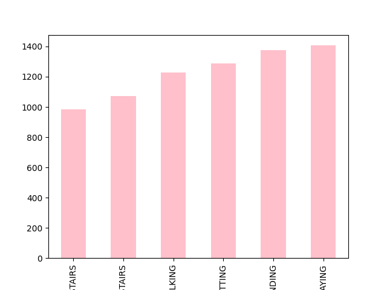
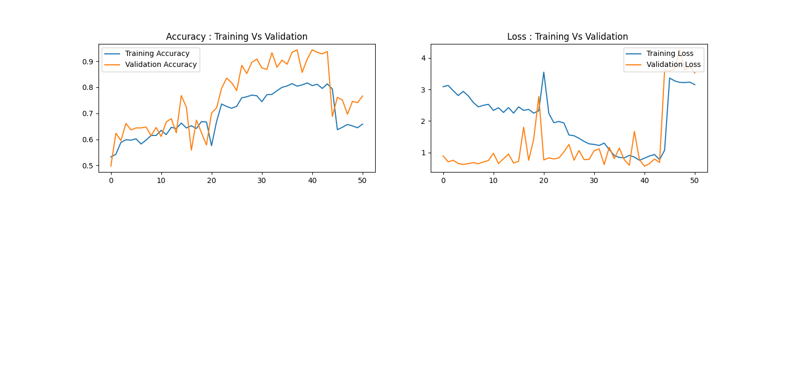

### TABLE OUTPUT

```

       fBodyAccJerk-kurtosis()-Y  fBodyAccJerk-skewness()-Z  \
count                7352.000000                7352.000000   
mean                   -0.819666                  -0.486687   
std                     0.143524                   0.202703   
min                    -1.000000                  -1.000000   
25%                    -0.912602                  -0.628908   
50%                    -0.855798                  -0.520183   
75%                    -0.771686                  -0.382036   
max                     1.000000                   1.000000   

       fBodyAccJerk-kurtosis()-Z  fBodyAccJerk-bandsEnergy()-1,8  \
count                7352.000000                     7352.000000   
mean                   -0.813261                       -0.862271   
std                     0.155852                        0.222068   
min                    -1.000000                       -1.000000   
25%                    -0.911486                       -0.999982   
50%                    -0.854965                       -0.999684   
75%                    -0.765678                       -0.795422   
max                     1.000000                        1.000000   

       fBodyAccJerk-bandsEnergy()-9,16  fBodyAccJerk-bandsEnergy()-17,24  \
count                      7352.000000                       7352.000000   
mean                         -0.889330                         -0.874505   
std                           0.172964                          0.205363   
min                          -1.000000                         -1.000000   
25%                          -0.999948                         -0.999913   
50%                          -0.999286                         -0.998893   
75%                          -0.814381                         -0.811868   
max                           1.000000                          1.000000   

       fBodyAccJerk-bandsEnergy()-25,32  fBodyAccJerk-bandsEnergy()-33,40  \
count                       7352.000000                       7352.000000   
mean                          -0.900673                         -0.920916   
std                            0.176096                          0.134189   
min                           -0.999996                         -1.000000   
25%                           -0.999864                         -0.999883   
50%                           -0.998836                         -0.999138   
75%                           -0.866677                         -0.887575   
max                            1.000000                          1.000000   

       fBodyAccJerk-bandsEnergy()-41,48  fBodyAccJerk-bandsEnergy()-49,56  \
count                       7352.000000                       7352.000000   
mean                          -0.901332                         -0.944111   
std                            0.170305                          0.104714   
min                           -1.000000                         -1.000000   
25%                           -0.999853                         -0.999924   
50%                           -0.999009                         -0.999403   
75%                           -0.858689                         -0.923106   
max                            1.000000                          1.000000   

       fBodyAccJerk-bandsEnergy()-57,64  fBodyAccJerk-bandsEnergy()-1,16  \
count                       7352.000000                      7352.000000   
mean                          -0.984059                        -0.867519   
std                            0.058027                         0.199389   
min                           -1.000000                        -1.000000   
25%                           -0.999992                        -0.999957   
50%                           -0.999894                        -0.999372   
75%                           -0.991362                        -0.785323   
max                            1.000000                         1.000000   

       fBodyAccJerk-bandsEnergy()-17,32  fBodyAccJerk-bandsEnergy()-33,48  \
count                       7352.000000                       7352.000000   
mean                          -0.856736                         -0.906287   
std                            0.229539                          0.153833   
min                           -1.000000                         -1.000000   
25%                           -0.999879                         -0.999872   
50%                           -0.998603                         -0.999011   
75%                           -0.781147                         -0.860558   
max                            1.000000                          1.000000   

       fBodyAccJerk-bandsEnergy()-49,64  fBodyAccJerk-bandsEnergy()-1,24  \
count                       7352.000000                      7352.000000   
mean                          -0.941997                        -0.845860   
std                            0.108720                         0.224673   
min                           -1.000000                        -1.000000   
25%                           -0.999922                        -0.999933   
50%                           -0.999367                        -0.999036   
75%                           -0.920355                        -0.734013   
max                            1.000000                         1.000000   

       fBodyAccJerk-bandsEnergy()-25,48  fBodyAccJerk-bandsEnergy()-1,8.1  \
count                       7352.000000                       7352.000000   
mean                          -0.863706                         -0.837982   
std                            0.223614                          0.223369   
min                           -1.000000                         -1.000000   
25%                           -0.999820                         -0.999846   
50%                           -0.998431                         -0.995919   
75%                           -0.801607                         -0.710863   
max                            1.000000                          0.702928   

       fBodyAccJerk-bandsEnergy()-9,16.1  fBodyAccJerk-bandsEnergy()-17,24.1  \
count                        7352.000000                         7352.000000   
mean                           -0.866906                           -0.838556   
std                             0.210453                            0.251556   
min                            -1.000000                           -1.000000   
25%                            -0.999885                           -0.999808   
50%                            -0.998213                           -0.997869   
75%                            -0.795837                           -0.741151   
max                             0.891736                            0.908361   

       fBodyAccJerk-bandsEnergy()-25,32.1  fBodyAccJerk-bandsEnergy()-33,40.1  \
count                         7352.000000                         7352.000000   
mean                            -0.911386                           -0.915458   
std                              0.150604                            0.146594   
min                             -1.000000                           -1.000000   
25%                             -0.999785                           -0.999719   
50%                             -0.998318                           -0.998349   
75%                             -0.871685                           -0.875587   
max                              0.887870                            0.632415   

       fBodyAccJerk-bandsEnergy()-41,48.1  fBodyAccJerk-bandsEnergy()-49,56.1  \
count                         7352.000000                         7352.000000   
mean                            -0.875857                           -0.922185   
std                              0.202419                            0.132046   
min                             -1.000000                           -1.000000   
25%                             -0.999606                           -0.999767   
50%                             -0.997379                           -0.998391   
75%                             -0.808732                           -0.886692   
max                              1.000000                            1.000000   

       fBodyAccJerk-bandsEnergy()-57,64.1  fBodyAccJerk-bandsEnergy()-1,16.1  \
count                         7352.000000                        7352.000000   
mean                            -0.970968                          -0.841155   
std                              0.094487                           0.231692   
min                             -1.000000                          -1.000000   
25%                             -0.999966                          -0.999859   
50%                             -0.999590                          -0.997389   
75%                             -0.984133                          -0.738502   
max                              1.000000                           0.897898   

       fBodyAccJerk-bandsEnergy()-17,32.1  fBodyAccJerk-bandsEnergy()-33,48.1  \
count                         7352.000000                         7352.000000   
mean                            -0.840422                           -0.878252   
std                              0.243017                            0.196251   
min                             -1.000000                           -1.000000   
25%                             -0.999767                           -0.999647   
50%                             -0.997615                           -0.997594   
75%                             -0.737590                           -0.808618   
max                              0.930317                            1.000000   

       fBodyAccJerk-bandsEnergy()-49,64.1  fBodyAccJerk-bandsEnergy()-1,24.1  \
count                         7352.000000                        7352.000000   
mean                            -0.928343                          -0.813372   
std                              0.121709                           0.261996   
min                             -1.000000                          -1.000000   
25%                             -0.999791                          -0.999811   
50%                             -0.998514                          -0.997126   
75%                             -0.895541                          -0.669063   
max                              1.000000                           0.914892   

       fBodyAccJerk-bandsEnergy()-25,48.1  fBodyAccJerk-bandsEnergy()-1,8.2  \
count                         7352.000000                       7352.000000   
mean                            -0.897427                         -0.896836   
std                              0.163570                          0.176060   
min                             -1.000000                         -1.000000   
25%                             -0.999746                         -0.999782   
50%                             -0.998020                         -0.997352   
75%                             -0.838430                         -0.856046   
max                              0.807375                          1.000000   

       fBodyAccJerk-bandsEnergy()-9,16.2  fBodyAccJerk-bandsEnergy()-17,24.2  \
count                        7352.000000                         7352.000000   
mean                           -0.896265                           -0.928006   
std                             0.186011                            0.143453   
min                            -1.000000                           -1.000000   
25%                            -0.999722                           -0.999785   
50%                            -0.998089                           -0.998916   
75%                            -0.853827                           -0.912162   
max                             1.000000                            1.000000   

       fBodyAccJerk-bandsEnergy()-25,32.2  fBodyAccJerk-bandsEnergy()-33,40.2  \
count                         7352.000000                         7352.000000   
mean                            -0.961320                           -0.965173   
std                              0.086525                            0.080711   
min                             -1.000000                           -0.999989   
25%                             -0.999816                           -0.999774   
50%                             -0.999190                           -0.999071   
75%                             -0.955756                           -0.960060   
max                              1.000000                            1.000000   

       fBodyAccJerk-bandsEnergy()-41,48.2  fBodyAccJerk-bandsEnergy()-49,56.2  \
count                         7352.000000                         7352.000000   
mean                            -0.938616                           -0.929004   
std                              0.123251                            0.140388   
min                             -0.999999                           -1.000000   
25%                             -0.999576                           -0.999493   
50%                             -0.998239                           -0.997874   
75%                             -0.923781                           -0.913918   
max                              1.000000                            1.000000   

       fBodyAccJerk-bandsEnergy()-57,64.2  fBodyAccJerk-bandsEnergy()-1,16.2  \
count                         7352.000000                        7352.000000   
mean                            -0.969494                          -0.874643   
std                              0.105767                           0.209179   
min                             -1.000000                          -1.000000   
25%                             -0.999928                          -0.999715   
50%                             -0.999397                          -0.997321   
75%                             -0.986985                          -0.815269   
max                              1.000000                           1.000000   

       fBodyAccJerk-bandsEnergy()-17,32.2  fBodyAccJerk-bandsEnergy()-33,48.2  \
count                         7352.000000                         7352.000000   
mean                            -0.944323                           -0.954820   
std                              0.110440                            0.095331   
min                             -1.000000                           -0.999967   
25%                             -0.999828                           -0.999706   
50%                             -0.999078                           -0.998779   
75%                             -0.927957                           -0.943950   
max                              1.000000                            1.000000   

       fBodyAccJerk-bandsEnergy()-49,64.2  fBodyAccJerk-bandsEnergy()-1,24.2  \
count                         7352.000000                        7352.000000   
mean                            -0.929141                          -0.895124   
std                              0.139890                           0.179630   
min                             -1.000000                          -1.000000   
25%                             -0.999496                          -0.999761   
50%                             -0.997868                          -0.998032   
75%                             -0.913291                          -0.844335   
max                              1.000000                           1.000000   

       fBodyAccJerk-bandsEnergy()-25,48.2  fBodyGyro-mean()-X  \
count                         7352.000000         7352.000000   
mean                            -0.958792           -0.673023   
std                              0.087392            0.357389   
min                             -0.999996           -1.000000   
25%                             -0.999797           -0.986202   
50%                             -0.999064           -0.902182   
75%                             -0.949013           -0.384163   
max                              1.000000            1.000000   

       fBodyGyro-mean()-Y  fBodyGyro-mean()-Z  fBodyGyro-std()-X  \
count         7352.000000         7352.000000        7352.000000   
mean            -0.701927           -0.645921          -0.737986   
std              0.347320            0.385655           0.291387   
min             -1.000000           -1.000000          -1.000000   
25%             -0.986026           -0.986845          -0.988851   
50%             -0.924834           -0.893751          -0.914419   
75%             -0.466151           -0.313330          -0.517878   
max              1.000000            1.000000           1.000000   

       fBodyGyro-std()-Y  fBodyGyro-std()-Z  fBodyGyro-mad()-X  \
count        7352.000000        7352.000000        7352.000000   
mean           -0.666284          -0.690888          -0.687314   
std             0.385693           0.341850           0.341027   
min            -1.000000          -1.000000          -1.000000   
25%            -0.982600          -0.987926          -0.987095   
50%            -0.913219          -0.899409          -0.902679   
75%            -0.425274          -0.413481          -0.409276   
max             1.000000           1.000000           1.000000   

       fBodyGyro-mad()-Y  fBodyGyro-mad()-Z  fBodyGyro-max()-X  \
count        7352.000000        7352.000000        7352.000000   
mean           -0.706784          -0.641824          -0.734628   
std             0.338829           0.389373           0.309752   
min            -1.000000          -1.000000          -1.000000   
25%            -0.985732          -0.986934          -0.989115   
50%            -0.926457          -0.893562          -0.916926   
75%            -0.486475          -0.302355          -0.530697   
max             1.000000           1.000000           1.000000   

       fBodyGyro-max()-Y  fBodyGyro-max()-Z  fBodyGyro-min()-X  \
count        7352.000000        7352.000000        7352.000000   
mean           -0.725522          -0.764726          -0.932140   
std             0.341160           0.277702           0.111714   
min            -1.000000          -1.000000          -1.000000   
25%            -0.985021          -0.989865          -0.997103   
50%            -0.923801          -0.917377          -0.983054   
75%            -0.555409          -0.579817          -0.906922   
max             1.000000           1.000000           0.465197   

       fBodyGyro-min()-Y  fBodyGyro-min()-Z  fBodyGyro-sma()  \
count        7352.000000        7352.000000      7352.000000   
mean           -0.898618          -0.907827        -0.659074   
std             0.162616           0.142476         0.369412   
min            -0.999997          -1.000000        -1.000000   
25%            -0.994918          -0.994939        -0.985820   
50%            -0.974996          -0.972247        -0.909380   
75%            -0.861146          -0.870339        -0.343124   
max             0.794498           1.000000         1.000000   

       fBodyGyro-energy()-X  fBodyGyro-energy()-Y  fBodyGyro-energy()-Z  \
count           7352.000000           7352.000000           7352.000000   
mean              -0.913636             -0.878004             -0.868188   
std                0.135372              0.205812              0.205901   
min               -1.000000             -1.000000             -1.000000   
25%               -0.999906             -0.999821             -0.999854   
50%               -0.995920             -0.996393             -0.993493   
75%               -0.862946             -0.836538             -0.775304   
max                1.000000              1.000000              1.000000   

       fBodyGyro-iqr()-X  fBodyGyro-iqr()-Y  fBodyGyro-iqr()-Z  \
count        7352.000000        7352.000000        7352.000000   
mean           -0.709390          -0.751877          -0.699288   
std             0.341549           0.314852           0.354309   
min            -1.000000          -1.000000          -1.000000   
25%            -0.990029          -0.991039          -0.990450   
50%            -0.941006          -0.948341          -0.939348   
75%            -0.456461          -0.575414          -0.438080   
max             1.000000           1.000000           1.000000   

       fBodyGyro-entropy()-X  fBodyGyro-entropy()-Y  fBodyGyro-entropy()-Z  \
count            7352.000000            7352.000000            7352.000000   
mean               -0.107762              -0.059081              -0.161948   
std                 0.614929               0.618804               0.608544   
min                -1.000000              -1.000000              -1.000000   
25%                -0.712930              -0.660647              -0.778737   
50%                -0.205097              -0.160476              -0.267517   
75%                 0.513258               0.560279               0.447782   
max                 1.000000               1.000000               1.000000   

       fBodyGyro-maxInds-X  fBodyGyro-maxInds-Y  fBodyGyro-maxInds-Z  \
count          7352.000000          7352.000000          7352.000000   
mean             -0.874528            -0.810901            -0.805251   
std               0.198211             0.282308             0.239759   
min              -1.000000            -1.000000            -1.000000   
25%              -1.000000            -1.000000            -1.000000   
50%              -0.933333            -0.935484            -0.931034   
75%              -0.866667            -0.741935            -0.655172   
max               1.000000             0.806452             0.655172   

       fBodyGyro-meanFreq()-X  fBodyGyro-meanFreq()-Y  fBodyGyro-meanFreq()-Z  \
count             7352.000000             7352.000000             7352.000000   
mean                -0.101212               -0.177143               -0.048458   
std                  0.259252                0.275970                0.265990   
min                 -1.000000               -1.000000               -0.966345   
25%                 -0.273703               -0.366620               -0.227480   
50%                 -0.099098               -0.176074               -0.051029   
75%                  0.070301                0.011205                0.125709   
max                  1.000000                0.993741                1.000000   

       fBodyGyro-skewness()-X  fBodyGyro-kurtosis()-X  fBodyGyro-skewness()-Y  \
count             7352.000000             7352.000000             7352.000000   
mean                -0.174696               -0.491359               -0.172800   
std                  0.323716                0.340773                0.346748   
min                 -1.000000               -1.000000               -1.000000   
25%                 -0.413912               -0.753757               -0.444181   
50%                 -0.217113               -0.581073               -0.240848   
75%                  0.034655               -0.301893                0.040830   
max                  0.920890                0.894495                0.981329   

       fBodyGyro-kurtosis()-Y  fBodyGyro-skewness()-Z  fBodyGyro-kurtosis()-Z  \
count             7352.000000             7352.000000             7352.000000   
mean                -0.528211               -0.216722               -0.536035   
std                  0.376928                0.330444                0.343582   
min                 -0.998213               -0.908981               -1.000000   
25%                 -0.813462               -0.474033               -0.802273   
50%                 -0.651751               -0.271327               -0.636850   
75%                 -0.355833               -0.006985               -0.358215   
max                  0.977608                0.903571                0.857113   

       fBodyGyro-bandsEnergy()-1,8  fBodyGyro-bandsEnergy()-9,16  \
count                  7352.000000                   7352.000000   
mean                     -0.928330                     -0.901325   
std                       0.121710                      0.170344   
min                      -1.000000                     -1.000000   
25%                      -0.999923                     -0.999938   
50%                      -0.996104                     -0.998053   
75%                      -0.898142                     -0.864353   
max                       1.000000                      1.000000   

       fBodyGyro-bandsEnergy()-17,24  fBodyGyro-bandsEnergy()-25,32  \
count                    7352.000000                    7352.000000   
mean                       -0.917860                      -0.959487   
std                         0.144680                       0.087298   
min                        -1.000000                      -1.000000   
25%                        -0.999946                      -0.999958   
50%                        -0.998699                      -0.998973   
75%                        -0.887668                      -0.951846   
max                         1.000000                       1.000000   

       fBodyGyro-bandsEnergy()-33,40  fBodyGyro-bandsEnergy()-41,48  \
count                    7352.000000                    7352.000000   
mean                       -0.949971                      -0.951686   
std                         0.109453                       0.097157   
min                        -1.000000                      -1.000000   
25%                        -0.999933                      -0.999924   
50%                        -0.998379                      -0.998171   
75%                        -0.938203                      -0.935944   
max                         1.000000                       1.000000   

       fBodyGyro-bandsEnergy()-49,56  fBodyGyro-bandsEnergy()-57,64  \
count                    7352.000000                    7352.000000   
mean                       -0.963539                      -0.975576   
std                         0.085151                       0.073776   
min                        -1.000000                      -1.000000   
25%                        -0.999953                      -0.999988   
50%                        -0.998313                      -0.999531   
75%                        -0.959245                      -0.984332   
max                         1.000000                       1.000000   

       fBodyGyro-bandsEnergy()-1,16  fBodyGyro-bandsEnergy()-17,32  \
count                   7352.000000                    7352.000000   
mean                      -0.918126                      -0.917404   
std                        0.130679                       0.145049   
min                       -1.000000                      -1.000000   
25%                       -0.999913                      -0.999939   
50%                       -0.996021                      -0.998526   
75%                       -0.873061                      -0.885910   
max                        1.000000                       1.000000   

       fBodyGyro-bandsEnergy()-33,48  fBodyGyro-bandsEnergy()-49,64  \
count                    7352.000000                    7352.000000   
mean                       -0.945640                      -0.968865   
std                         0.111479                       0.078319   
min                        -0.999997                      -1.000000   
25%                        -0.999922                      -0.999967   
50%                        -0.998083                      -0.998450   
75%                        -0.930211                      -0.969263   
max                         1.000000                       1.000000   

       fBodyGyro-bandsEnergy()-1,24  fBodyGyro-bandsEnergy()-25,48  \
count                   7352.000000                    7352.000000   
mean                      -0.915047                      -0.955048   
std                        0.133612                       0.092673   
min                       -1.000000                      -0.999998   
25%                       -0.999910                      -0.999945   
50%                       -0.995969                      -0.998708   
75%                       -0.865454                      -0.941403   
max                        1.000000                       1.000000   

       fBodyGyro-bandsEnergy()-1,8.1  fBodyGyro-bandsEnergy()-9,16.1  \
count                    7352.000000                     7352.000000   
mean                       -0.869902                       -0.955349   
std                         0.234323                        0.110319   
min                        -1.000000                       -1.000000   
25%                        -0.999770                       -0.999969   
50%                        -0.995135                       -0.999137   
75%                        -0.839723                       -0.953427   
max                         1.000000                        1.000000   

       fBodyGyro-bandsEnergy()-17,24.1  fBodyGyro-bandsEnergy()-25,32.1  \
count                      7352.000000                      7352.000000   
mean                         -0.956962                        -0.965885   
std                           0.124628                         0.093767   
min                          -1.000000                        -1.000000   
25%                          -0.999981                        -0.999974   
50%                          -0.999555                        -0.999528   
75%                          -0.964263                        -0.970067   
max                           1.000000                         1.000000   

       fBodyGyro-bandsEnergy()-33,40.1  fBodyGyro-bandsEnergy()-41,48.1  \
count                      7352.000000                      7352.000000   
mean                         -0.976601                        -0.955939   
std                           0.064748                         0.103573   
min                          -1.000000                        -1.000000   
25%                          -0.999972                        -0.999941   
50%                          -0.999543                        -0.998974   
75%                          -0.975924                        -0.952759   
max                           1.000000                         1.000000   

       fBodyGyro-bandsEnergy()-49,56.1  fBodyGyro-bandsEnergy()-57,64.1  \
count                      7352.000000                      7352.000000   
mean                         -0.949943                        -0.974797   
std                           0.120509                         0.080004   
min                          -1.000000                        -1.000000   
25%                          -0.999935                        -0.999980   
50%                          -0.998536                        -0.999512   
75%                          -0.947507                        -0.986350   
max                           1.000000                         1.000000   

       fBodyGyro-bandsEnergy()-1,16.1  fBodyGyro-bandsEnergy()-17,32.1  \
count                     7352.000000                      7352.000000   
mean                        -0.883363                        -0.949409   
std                          0.199334                         0.137302   
min                         -1.000000                        -1.000000   
25%                         -0.999812                        -0.999973   
50%                         -0.996017                        -0.999434   
75%                         -0.845339                        -0.955043   
max                          1.000000                         1.000000   

       fBodyGyro-bandsEnergy()-33,48.1  fBodyGyro-bandsEnergy()-49,64.1  \
count                      7352.000000                      7352.000000   
mean                         -0.972119                        -0.953901   
std                           0.071548                         0.112521   
min                          -1.000000                        -1.000000   
25%                          -0.999965                        -0.999942   
50%                          -0.999402                        -0.998466   
75%                          -0.970197                        -0.954132   
max                           1.000000                         1.000000   

       fBodyGyro-bandsEnergy()-1,24.1  fBodyGyro-bandsEnergy()-25,48.1  \
count                     7352.000000                      7352.000000   
mean                        -0.871034                        -0.965195   
std                          0.217736                         0.091729   
min                         -1.000000                        -1.000000   
25%                         -0.999811                        -0.999968   
50%                         -0.996099                        -0.999443   
75%                         -0.828925                        -0.966346   
max                          1.000000                         1.000000   

       fBodyGyro-bandsEnergy()-1,8.2  fBodyGyro-bandsEnergy()-9,16.2  \
count                    7352.000000                     7352.000000   
mean                       -0.898191                       -0.931967   
std                         0.178255                        0.137956   
min                        -1.000000                       -1.000000   
25%                        -0.999880                       -0.999949   
50%                        -0.994192                       -0.998487   
75%                        -0.838998                       -0.912214   
max                         1.000000                        1.000000   

       fBodyGyro-bandsEnergy()-17,24.2  fBodyGyro-bandsEnergy()-25,32.2  \
count                      7352.000000                      7352.000000   
mean                         -0.929685                        -0.966978   
std                           0.143150                         0.076408   
min                          -1.000000                        -1.000000   
25%                          -0.999949                        -0.999958   
50%                          -0.998865                        -0.999139   
75%                          -0.911993                        -0.962784   
max                           1.000000                         1.000000   

       fBodyGyro-bandsEnergy()-33,40.2  fBodyGyro-bandsEnergy()-41,48.2  \
count                      7352.000000                      7352.000000   
mean                         -0.971625                        -0.960644   
std                           0.065473                         0.081636   
min                          -1.000000                        -1.000000   
25%                          -0.999942                        -0.999897   
50%                          -0.998887                        -0.997954   
75%                          -0.966576                        -0.950835   
max                           1.000000                         1.000000   

       fBodyGyro-bandsEnergy()-49,56.2  fBodyGyro-bandsEnergy()-57,64.2  \
count                      7352.000000                      7352.000000   
mean                         -0.951566                        -0.968726   
std                           0.104415                         0.094335   
min                          -1.000000                        -1.000000   
25%                          -0.999882                        -0.999975   
50%                          -0.996174                        -0.999013   
75%                          -0.947158                        -0.981185   
max                           1.000000                         1.000000   

       fBodyGyro-bandsEnergy()-1,16.2  fBodyGyro-bandsEnergy()-17,32.2  \
count                     7352.000000                      7352.000000   
mean                        -0.880352                        -0.916966   
std                          0.194630                         0.165516   
min                         -1.000000                        -1.000000   
25%                         -0.999866                        -0.999932   
50%                         -0.993819                        -0.998495   
75%                         -0.802929                        -0.894045   
max                          1.000000                         1.000000   

       fBodyGyro-bandsEnergy()-33,48.2  fBodyGyro-bandsEnergy()-49,64.2  \
count                      7352.000000                      7352.000000   
mean                         -0.968571                        -0.959027   
std                           0.068311                         0.097214   
min                          -1.000000                        -1.000000   
25%                          -0.999936                        -0.999918   
50%                          -0.998651                        -0.996496   
75%                          -0.961241                        -0.958772   
max                           1.000000                         1.000000   

       fBodyGyro-bandsEnergy()-1,24.2  fBodyGyro-bandsEnergy()-25,48.2  \
count                     7352.000000                      7352.000000   
mean                        -0.871469                        -0.967474   
std                          0.202235                         0.071870   
min                         -1.000000                        -1.000000   
25%                         -0.999858                        -0.999953   
50%                         -0.993618                        -0.998953   
75%                         -0.781717                        -0.960825   
max                          1.000000                         1.000000   

       fBodyAccMag-mean()  fBodyAccMag-std()  fBodyAccMag-mad()  \
count         7352.000000        7352.000000        7352.000000   
mean            -0.585535          -0.656495          -0.593985   
std              0.452685           0.362632           0.436564   
min             -0.999893          -1.000000          -1.000000   
25%             -0.985637          -0.983904          -0.982596   
50%             -0.885615          -0.862183          -0.867997   
75%             -0.206100          -0.377440          -0.244431   
max              1.000000           1.000000           1.000000   

       fBodyAccMag-max()  fBodyAccMag-min()  fBodyAccMag-sma()  \
count        7352.000000        7352.000000        7352.000000   
mean           -0.753204          -0.890826          -0.585535   
std             0.265121           0.161504           0.452685   
min            -1.000000          -1.000000          -0.999893   
25%            -0.987227          -0.991787          -0.985637   
50%            -0.884708          -0.970860          -0.885615   
75%            -0.565923          -0.839266          -0.206100   
max             1.000000           1.000000           1.000000   

       fBodyAccMag-energy()  fBodyAccMag-iqr()  fBodyAccMag-entropy()  \
count           7352.000000        7352.000000            7352.000000   
mean              -0.817448          -0.694983              -0.197927   
std                0.256107           0.350360               0.682710   
min               -1.000000          -1.000000              -1.000000   
25%               -0.999693          -0.988417              -0.892530   
50%               -0.987951          -0.936213              -0.391187   
75%               -0.700713          -0.425347               0.497207   
max                1.000000           1.000000               1.000000   

       fBodyAccMag-maxInds  fBodyAccMag-meanFreq()  fBodyAccMag-skewness()  \
count          7352.000000             7352.000000             7352.000000   
mean             -0.751154                0.073137               -0.347257   
std               0.268736                0.267248                0.328649   
min              -1.000000               -1.000000               -1.000000   
25%              -1.000000               -0.098940               -0.574693   
50%              -0.793103                0.067694               -0.418500   
75%              -0.517241                0.241701               -0.196372   
max               1.000000                1.000000                1.000000   

       fBodyAccMag-kurtosis()  fBodyBodyAccJerkMag-mean()  \
count             7352.000000                 7352.000000   
mean                -0.626638                   -0.624264   
std                  0.327387                    0.428842   
min                 -1.000000                   -1.000000   
25%                 -0.844214                   -0.990351   
50%                 -0.732281                   -0.940338   
75%                 -0.525252                   -0.258889   
max                  1.000000                    1.000000   

       fBodyBodyAccJerkMag-std()  fBodyBodyAccJerkMag-mad()  \
count                7352.000000                7352.000000   
mean                   -0.646927                  -0.618750   
std                     0.404718                   0.433688   
min                    -0.999960                  -0.999152   
25%                    -0.991126                  -0.988719   
50%                    -0.937284                  -0.934289   
75%                    -0.314050                  -0.249015   
max                     1.000000                   1.000000   

       fBodyBodyAccJerkMag-max()  fBodyBodyAccJerkMag-min()  \
count                7352.000000                7352.000000   
mean                   -0.691182                  -0.806277   
std                     0.366049                   0.269535   
min                    -1.000000                  -1.000000   
25%                    -0.992775                  -0.987153   
50%                    -0.943895                  -0.962788   
75%                    -0.421957                  -0.684095   
max                     1.000000                   1.000000   

       fBodyBodyAccJerkMag-sma()  fBodyBodyAccJerkMag-energy()  \
count                7352.000000                   7352.000000   
mean                   -0.624264                     -0.842188   
std                     0.428842                      0.230580   
min                    -1.000000                     -1.000000   
25%                    -0.990351                     -0.999862   
50%                    -0.940338                     -0.997494   
75%                    -0.258889                     -0.731425   
max                     1.000000                      1.000000   

       fBodyBodyAccJerkMag-iqr()  fBodyBodyAccJerkMag-entropy()  \
count                7352.000000                    7352.000000   
mean                   -0.678618                      -0.347657   
std                     0.370612                       0.670112   
min                    -0.999499                      -1.000000   
25%                    -0.989044                      -1.000000   
50%                    -0.950502                      -0.740806   
75%                    -0.371989                       0.350640   
max                     1.000000                       1.000000   

       fBodyBodyAccJerkMag-maxInds  fBodyBodyAccJerkMag-meanFreq()  \
count                  7352.000000                     7352.000000   
mean                     -0.877995                        0.178195   
std                       0.188636                        0.253755   
min                      -1.000000                       -1.000000   
25%                      -0.968254                       -0.000409   
50%                      -0.904762                        0.168645   
75%                      -0.873016                        0.364240   
max                       1.000000                        0.975821   

       fBodyBodyAccJerkMag-skewness()  fBodyBodyAccJerkMag-kurtosis()  \
count                     7352.000000                     7352.000000   
mean                        -0.312968                       -0.615441   
std                          0.358631                        0.345329   
min                         -1.000000                       -1.000000   
25%                         -0.607485                       -0.882254   
50%                         -0.364784                       -0.727332   
75%                         -0.082569                       -0.449997   
max                          1.000000                        1.000000   

       fBodyBodyGyroMag-mean()  fBodyBodyGyroMag-std()  \
count              7352.000000             7352.000000   
mean                 -0.693210               -0.692876   
std                   0.335026                0.322850   
min                  -1.000000               -1.000000   
25%                  -0.984123               -0.980329   
50%                  -0.886439               -0.837698   
75%                  -0.438439               -0.451900   
max                   1.000000                1.000000   

       fBodyBodyGyroMag-mad()  fBodyBodyGyroMag-max()  fBodyBodyGyroMag-min()  \
count             7352.000000             7352.000000             7352.000000   
mean                -0.674830               -0.726645               -0.885103   
std                  0.343454                0.293098                0.173574   
min                 -1.000000               -1.000000               -1.000000   
25%                 -0.980453               -0.981029               -0.994189   
50%                 -0.859053               -0.836296               -0.960136   
75%                 -0.397123               -0.540666               -0.837425   
max                  1.000000                0.842119                1.000000   

       fBodyBodyGyroMag-sma()  fBodyBodyGyroMag-energy()  \
count             7352.000000                7352.000000   
mean                -0.693210                  -0.874292   
std                  0.335026                   0.192684   
min                 -1.000000                  -1.000000   
25%                 -0.984123                  -0.999725   
50%                 -0.886439                  -0.986266   
75%                 -0.438439                  -0.800743   
max                  1.000000                   1.000000   

       fBodyBodyGyroMag-iqr()  fBodyBodyGyroMag-entropy()  \
count             7352.000000                 7352.000000   
mean                -0.719795                   -0.087878   
std                  0.318706                    0.611793   
min                 -1.000000                   -1.000000   
25%                 -0.986633                   -0.690397   
50%                 -0.923298                   -0.190223   
75%                 -0.484202                    0.515789   
max                  1.000000                    1.000000   

       fBodyBodyGyroMag-maxInds  fBodyBodyGyroMag-meanFreq()  \
count               7352.000000                  7352.000000   
mean                  -0.889442                    -0.046516   
std                    0.157653                     0.282665   
min                   -1.000000                    -0.997500   
25%                   -1.000000                    -0.240882   
50%                   -0.948718                    -0.061597   
75%                   -0.846154                     0.148795   
max                    1.000000                     1.000000   

       fBodyBodyGyroMag-skewness()  fBodyBodyGyroMag-kurtosis()  \
count                  7352.000000                  7352.000000   
mean                     -0.253649                    -0.565425   
std                       0.326624                     0.326620   
min                      -1.000000                    -1.000000   
25%                      -0.492028                    -0.802207   
50%                      -0.309252                    -0.655594   
75%                      -0.069952                    -0.428376   
max                       0.969311                     0.949350   

       fBodyBodyGyroJerkMag-mean()  fBodyBodyGyroJerkMag-std()  \
count                  7352.000000                 7352.000000   
mean                     -0.779376                   -0.792391   
std                       0.275733                    0.265434   
min                      -0.999996                   -1.000000   
25%                      -0.993100                   -0.993508   
50%                      -0.952398                   -0.947140   
75%                      -0.611952                   -0.642627   
max                       1.000000                    1.000000   

       fBodyBodyGyroJerkMag-mad()  fBodyBodyGyroJerkMag-max()  \
count                 7352.000000                 7352.000000   
mean                    -0.772836                   -0.811409   
std                      0.287613                    0.246680   
min                     -1.000000                   -1.000000   
25%                     -0.992736                   -0.994355   
50%                     -0.945223                   -0.950796   
75%                     -0.608047                   -0.688776   
max                      1.000000                    1.000000   

       fBodyBodyGyroJerkMag-min()  fBodyBodyGyroJerkMag-sma()  \
count                 7352.000000                 7352.000000   
mean                    -0.871927                   -0.779376   
std                      0.193344                    0.275733   
min                     -1.000000                   -0.999996   
25%                     -0.994065                   -0.993100   
50%                     -0.975676                   -0.952398   
75%                     -0.808263                   -0.611952   
max                      1.000000                    1.000000   

       fBodyBodyGyroJerkMag-energy()  fBodyBodyGyroJerkMag-iqr()  \
count                    7352.000000                 7352.000000   
mean                       -0.935785                   -0.771497   
std                         0.138683                    0.287577   
min                        -1.000000                   -1.000000   
25%                        -0.999957                   -0.992268   
50%                        -0.998471                   -0.949768   
75%                        -0.922503                   -0.603952   
max                         1.000000                    1.000000   

       fBodyBodyGyroJerkMag-entropy()  fBodyBodyGyroJerkMag-maxInds  \
count                     7352.000000                   7352.000000   
mean                        -0.284627                     -0.898859   
std                          0.630896                      0.143135   
min                         -1.000000                     -1.000000   
25%                         -0.955696                     -0.968254   
50%                         -0.455569                     -0.904762   
75%                          0.336785                     -0.873016   
max                          1.000000                      0.968254   

       fBodyBodyGyroJerkMag-meanFreq()  fBodyBodyGyroJerkMag-skewness()  \
count                      7352.000000                      7352.000000   
mean                          0.125293                        -0.307009   
std                           0.250994                         0.321011   
min                          -1.000000                        -0.995357   
25%                          -0.023692                        -0.542602   
50%                           0.134000                        -0.343685   
75%                           0.289096                        -0.126979   
max                           0.946700                         0.989538   

       fBodyBodyGyroJerkMag-kurtosis()  angle(tBodyAccMean,gravity)  \
count                      7352.000000                  7352.000000   
mean                         -0.625294                     0.008684   
std                           0.307584                     0.336787   
min                          -0.999765                    -0.976580   
25%                          -0.845573                    -0.121527   
50%                          -0.711692                     0.009509   
75%                          -0.503878                     0.150865   
max                           0.956845                     1.000000   

       angle(tBodyAccJerkMean),gravityMean)  angle(tBodyGyroMean,gravityMean)  \
count                           7352.000000                       7352.000000   
mean                               0.002186                          0.008726   
std                                0.448306                          0.608303   
min                               -1.000000                         -1.000000   
25%                               -0.289549                         -0.482273   
50%                                0.008943                          0.008735   
75%                                0.292861                          0.506187   
max                                1.000000                          0.998702   

       angle(tBodyGyroJerkMean,gravityMean)  angle(X,gravityMean)  \
count                           7352.000000           7352.000000   
mean                              -0.005981             -0.489547   
std                                0.477975              0.511807   
min                               -1.000000             -1.000000   
25%                               -0.376341             -0.812065   
50%                               -0.000368             -0.709417   
75%                                0.359368             -0.509079   
max                                0.996078              1.000000   

       angle(Y,gravityMean)  angle(Z,gravityMean)      subject  
count           7352.000000           7352.000000  7352.000000  
mean               0.058593             -0.056515    17.413085  
std                0.297480              0.279122     8.975143  
min               -1.000000             -1.000000     1.000000  
25%               -0.017885             -0.143414     8.000000  
50%                0.182071              0.003181    19.000000  
75%                0.248353              0.107659    26.000000  
max                0.478157              1.000000    30.000000  
['STANDING' 'SITTING' 'LAYING' 'WALKING' 'WALKING_DOWNSTAIRS'
 'WALKING_UPSTAIRS']
Epoch 1/10
115/115 [==============================] - 1s 2ms/step - loss: 1.3047 - accuracy: 0.4940 - val_loss: 1.0381 - val_accuracy: 0.8195
Epoch 2/10
115/115 [==============================] - 0s 1ms/step - loss: 0.8837 - accuracy: 0.7350 - val_loss: 0.7262 - val_accuracy: 0.8320
Epoch 3/10
115/115 [==============================] - 0s 1ms/step - loss: 0.6159 - accuracy: 0.8247 - val_loss: 0.5297 - val_accuracy: 0.8358
Epoch 4/10
115/115 [==============================] - 0s 1ms/step - loss: 0.4640 - accuracy: 0.8696 - val_loss: 0.4207 - val_accuracy: 0.8697
Epoch 5/10
115/115 [==============================] - 0s 1ms/step - loss: 0.3739 - accuracy: 0.8874 - val_loss: 0.3618 - val_accuracy: 0.8677
Epoch 6/10
115/115 [==============================] - 0s 1ms/step - loss: 0.3119 - accuracy: 0.9041 - val_loss: 0.3002 - val_accuracy: 0.9053
Epoch 7/10
115/115 [==============================] - 0s 1ms/step - loss: 0.2720 - accuracy: 0.9155 - val_loss: 0.2698 - val_accuracy: 0.9104
Epoch 8/10
115/115 [==============================] - 0s 1ms/step - loss: 0.2405 - accuracy: 0.9218 - val_loss: 0.2729 - val_accuracy: 0.8951
Epoch 9/10
115/115 [==============================] - 0s 1ms/step - loss: 0.2153 - accuracy: 0.9274 - val_loss: 0.2221 - val_accuracy: 0.9206
Epoch 10/10
115/115 [==============================] - 0s 1ms/step - loss: 0.1950 - accuracy: 0.9362 - val_loss: 0.2052 - val_accuracy: 0.9281
Reloading Tuner from project/Human_activity_recognition/tuner0.json
Epoch 1/51
230/230 [==============================] - 4s 10ms/step - loss: 3.0867 - accuracy: 0.5325 - val_loss: 0.8936 - val_accuracy: 0.4971
Epoch 2/51
230/230 [==============================] - 2s 9ms/step - loss: 3.1275 - accuracy: 0.5427 - val_loss: 0.7089 - val_accuracy: 0.6233
Epoch 3/51
230/230 [==============================] - 2s 9ms/step - loss: 2.9626 - accuracy: 0.5884 - val_loss: 0.7565 - val_accuracy: 0.5955
Epoch 4/51
230/230 [==============================] - 2s 9ms/step - loss: 2.8059 - accuracy: 0.5987 - val_loss: 0.6547 - val_accuracy: 0.6614
Epoch 5/51
230/230 [==============================] - 2s 9ms/step - loss: 2.9386 - accuracy: 0.5971 - val_loss: 0.6271 - val_accuracy: 0.6362
Epoch 6/51
230/230 [==============================] - 2s 9ms/step - loss: 2.7969 - accuracy: 0.6023 - val_loss: 0.6477 - val_accuracy: 0.6440
Epoch 7/51
230/230 [==============================] - 2s 9ms/step - loss: 2.5861 - accuracy: 0.5823 - val_loss: 0.6829 - val_accuracy: 0.6440
Epoch 8/51
230/230 [==============================] - 2s 9ms/step - loss: 2.4485 - accuracy: 0.5971 - val_loss: 0.6480 - val_accuracy: 0.6474
Epoch 9/51
230/230 [==============================] - 2s 9ms/step - loss: 2.4967 - accuracy: 0.6151 - val_loss: 0.7046 - val_accuracy: 0.6145
Epoch 10/51
230/230 [==============================] - 3s 11ms/step - loss: 2.5280 - accuracy: 0.6152 - val_loss: 0.7480 - val_accuracy: 0.6457
Epoch 11/51
230/230 [==============================] - 2s 11ms/step - loss: 2.3340 - accuracy: 0.6348 - val_loss: 0.9778 - val_accuracy: 0.6111
Epoch 12/51
230/230 [==============================] - 2s 11ms/step - loss: 2.4214 - accuracy: 0.6182 - val_loss: 0.6541 - val_accuracy: 0.6668
Epoch 13/51
230/230 [==============================] - 2s 10ms/step - loss: 2.2704 - accuracy: 0.6462 - val_loss: 0.8044 - val_accuracy: 0.6797
Epoch 14/51
230/230 [==============================] - 2s 10ms/step - loss: 2.4263 - accuracy: 0.6419 - val_loss: 0.9541 - val_accuracy: 0.6254
Epoch 15/51
230/230 [==============================] - 2s 11ms/step - loss: 2.2488 - accuracy: 0.6628 - val_loss: 0.6675 - val_accuracy: 0.7682
Epoch 16/51
230/230 [==============================] - 2s 10ms/step - loss: 2.4479 - accuracy: 0.6439 - val_loss: 0.7243 - val_accuracy: 0.7238
Epoch 17/51
230/230 [==============================] - 2s 10ms/step - loss: 2.3359 - accuracy: 0.6523 - val_loss: 1.8051 - val_accuracy: 0.5585
Epoch 18/51
230/230 [==============================] - 2s 11ms/step - loss: 2.3685 - accuracy: 0.6419 - val_loss: 0.7580 - val_accuracy: 0.6739
Epoch 19/51
230/230 [==============================] - 2s 11ms/step - loss: 2.2494 - accuracy: 0.6681 - val_loss: 1.4278 - val_accuracy: 0.6257
Epoch 20/51
230/230 [==============================] - 2s 10ms/step - loss: 2.3245 - accuracy: 0.6668 - val_loss: 2.7766 - val_accuracy: 0.5786
Epoch 21/51
230/230 [==============================] - 2s 11ms/step - loss: 3.5480 - accuracy: 0.5758 - val_loss: 0.7665 - val_accuracy: 0.7007
Epoch 22/51
230/230 [==============================] - 3s 11ms/step - loss: 2.2415 - accuracy: 0.6681 - val_loss: 0.8321 - val_accuracy: 0.7207
Epoch 23/51
230/230 [==============================] - 2s 11ms/step - loss: 1.9457 - accuracy: 0.7359 - val_loss: 0.7970 - val_accuracy: 0.7961
Epoch 24/51
230/230 [==============================] - 2s 11ms/step - loss: 1.9863 - accuracy: 0.7263 - val_loss: 0.8323 - val_accuracy: 0.8351
Epoch 25/51
230/230 [==============================] - 2s 11ms/step - loss: 1.9376 - accuracy: 0.7195 - val_loss: 1.0213 - val_accuracy: 0.8178
Epoch 26/51
230/230 [==============================] - 3s 11ms/step - loss: 1.5566 - accuracy: 0.7270 - val_loss: 1.2590 - val_accuracy: 0.7872
Epoch 27/51
230/230 [==============================] - 2s 11ms/step - loss: 1.5343 - accuracy: 0.7595 - val_loss: 0.7566 - val_accuracy: 0.8843
Epoch 28/51
230/230 [==============================] - 3s 11ms/step - loss: 1.4518 - accuracy: 0.7636 - val_loss: 1.0643 - val_accuracy: 0.8527
Epoch 29/51
230/230 [==============================] - 2s 11ms/step - loss: 1.3546 - accuracy: 0.7699 - val_loss: 0.7768 - val_accuracy: 0.8955
Epoch 30/51
230/230 [==============================] - 3s 11ms/step - loss: 1.2762 - accuracy: 0.7674 - val_loss: 0.7853 - val_accuracy: 0.9084
Epoch 31/51
230/230 [==============================] - 3s 11ms/step - loss: 1.2584 - accuracy: 0.7446 - val_loss: 1.0592 - val_accuracy: 0.8744
Epoch 32/51
230/230 [==============================] - 3s 11ms/step - loss: 1.2247 - accuracy: 0.7718 - val_loss: 1.1181 - val_accuracy: 0.8687
Epoch 33/51
230/230 [==============================] - 3s 11ms/step - loss: 1.3009 - accuracy: 0.7726 - val_loss: 0.6199 - val_accuracy: 0.9328
Epoch 34/51
230/230 [==============================] - 2s 10ms/step - loss: 1.0953 - accuracy: 0.7866 - val_loss: 1.1666 - val_accuracy: 0.8768
Epoch 35/51
230/230 [==============================] - 2s 11ms/step - loss: 0.9063 - accuracy: 0.7996 - val_loss: 0.8094 - val_accuracy: 0.9043
Epoch 36/51
230/230 [==============================] - 2s 11ms/step - loss: 0.8452 - accuracy: 0.8051 - val_loss: 1.1416 - val_accuracy: 0.8884
Epoch 37/51
230/230 [==============================] - 2s 11ms/step - loss: 0.8360 - accuracy: 0.8139 - val_loss: 0.7708 - val_accuracy: 0.9342
Epoch 38/51
230/230 [==============================] - 3s 12ms/step - loss: 0.9113 - accuracy: 0.8043 - val_loss: 0.5999 - val_accuracy: 0.9437
Epoch 39/51
230/230 [==============================] - 2s 10ms/step - loss: 0.8570 - accuracy: 0.8092 - val_loss: 1.6707 - val_accuracy: 0.8571
Epoch 40/51
230/230 [==============================] - 2s 10ms/step - loss: 0.7558 - accuracy: 0.8165 - val_loss: 0.7761 - val_accuracy: 0.9074
Epoch 41/51
230/230 [==============================] - 2s 11ms/step - loss: 0.8224 - accuracy: 0.8066 - val_loss: 0.5685 - val_accuracy: 0.9440
Epoch 42/51
230/230 [==============================] - 2s 10ms/step - loss: 0.8916 - accuracy: 0.8115 - val_loss: 0.6517 - val_accuracy: 0.9338
Epoch 43/51
230/230 [==============================] - 2s 11ms/step - loss: 0.9377 - accuracy: 0.7956 - val_loss: 0.7959 - val_accuracy: 0.9284
Epoch 44/51
230/230 [==============================] - 2s 11ms/step - loss: 0.7752 - accuracy: 0.8130 - val_loss: 0.6859 - val_accuracy: 0.9372
Epoch 45/51
230/230 [==============================] - 2s 11ms/step - loss: 1.0753 - accuracy: 0.7935 - val_loss: 3.6142 - val_accuracy: 0.6878
Epoch 46/51
230/230 [==============================] - 2s 10ms/step - loss: 3.3600 - accuracy: 0.6372 - val_loss: 3.5792 - val_accuracy: 0.7615
Epoch 47/51
230/230 [==============================] - 2s 10ms/step - loss: 3.2711 - accuracy: 0.6465 - val_loss: 3.6604 - val_accuracy: 0.7509
Epoch 48/51
230/230 [==============================] - 2s 11ms/step - loss: 3.2232 - accuracy: 0.6572 - val_loss: 4.2571 - val_accuracy: 0.6966
Epoch 49/51
230/230 [==============================] - 2s 11ms/step - loss: 3.2182 - accuracy: 0.6518 - val_loss: 3.6099 - val_accuracy: 0.7458
Epoch 50/51
230/230 [==============================] - 2s 10ms/step - loss: 3.2316 - accuracy: 0.6446 - val_loss: 3.7370 - val_accuracy: 0.7411
Epoch 51/51
230/230 [==============================] - 3s 12ms/step - loss: 3.1512 - accuracy: 0.6587 - val_loss: 3.5197 - val_accuracy: 0.7665
Model: "sequential"
_________________________________________________________________
 Layer (type)                Output Shape              Param #   
=================================================================
 dense (Dense)               (None, 32)                17984     
                                                                 
 dense_1 (Dense)             (None, 224)               7392      
                                                                 
 dense_2 (Dense)             (None, 64)                14400     
                                                                 
 dense_3 (Dense)             (None, 192)               12480     
                                                                 
 dense_4 (Dense)             (None, 352)               67936     
                                                                 
 dense_5 (Dense)             (None, 352)               124256    
                                                                 
 dense_6 (Dense)             (None, 320)               112960    
                                                                 
 dense_7 (Dense)             (None, 384)               123264    
                                                                 
 dense_8 (Dense)             (None, 352)               135520    
                                                                 
 dense_9 (Dense)             (None, 32)                11296     
                                                                 
 dense_10 (Dense)            (None, 320)               10560     
                                                                 
 dense_11 (Dense)            (None, 352)               112992    
                                                                 
 dense_12 (Dense)            (None, 64)                22592     
                                                                 
 dense_13 (Dense)            (None, 224)               14560     
                                                                 
 dense_14 (Dense)            (None, 128)               28800     
                                                                 
 dense_15 (Dense)            (None, 352)               45408     
                                                                 
 dense_16 (Dense)            (None, 320)               112960    
                                                                 
 dense_17 (Dense)            (None, 352)               112992    
                                                                 
 dense_18 (Dense)            (None, 416)               146848    
                                                                 
 dense_19 (Dense)            (None, 352)               146784    
                                                                 
 dense_20 (Dense)            (None, 480)               169440    
                                                                 
 dense_21 (Dense)            (None, 480)               230880    
                                                                 
 dense_22 (Dense)            (None, 32)                15392     
                                                                 
 dense_23 (Dense)            (None, 32)                1056      
                                                                 
 dense_24 (Dense)            (None, 32)                1056      
                                                                 
 dense_25 (Dense)            (None, 6)                 198       
                                                                 
 dropout (Dropout)           (None, 6)                 0         
                                                                 
=================================================================
Total params: 1800006 (6.87 MB)
Trainable params: 1800006 (6.87 MB)
Non-trainable params: 0 (0.00 Byte)
_________________________________________________________________
None
```


# HumanActivityRecognitionWithNeuralNetworks


```
CORE PAPER : https://www.kaggle.com/code/fahadmehfoooz/human-activity-recognition-with-neural-networks

```